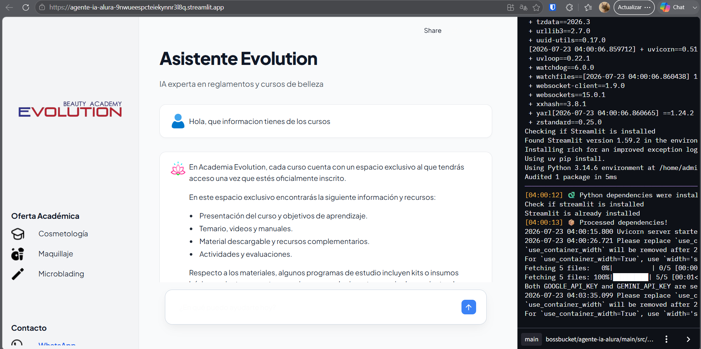

Markdown
# Agente IA - Academia Evolution 🤖

Aplicación conversacional e inteligente desarrollada para la **Academia Evolution** utilizando la arquitectura **RAG (Retrieval-Augmented Generation)**, **LangChain**, **Google Gemini** y **Streamlit**. Permite resolver dudas de los usuarios consultando la documentación oficial, guías y reglamentos de la institución en tiempo real.

---
## ❓ Preguntas Frecuentes (FAQ) - Asistente Evolution

#### ¿Cuáles son las normas de higiene y presentación personal que debo cumplir durante las clases?
#### ¿Qué responsabilidad tengo sobre el mobiliario, equipos y herramientas de la academia?
#### ¿Se permite la inscripción de menores de edad en los cursos?
#### ¿Cómo puedo ejercer mis derechos de acceso, rectificación o eliminación de mis datos personales?

---


## Demostración y Deploy

* **Aplicación en vivo:** [https://agente-ia-alura-9nwueespcteiekynnr3l8q.streamlit.app/](https://tu-app-de-streamlit.streamlit.app) *

###  Captura de Pantalla



---

## 🏗️ Arquitectura del Sistema

El proyecto utiliza una arquitectura modular limpia orientada al procesamiento de lenguaje natural y búsqueda semántica:

```text
AGENTE-IA-ALURA/
├── data/
│   ├── assets/              # Iconos de la interfaz (icon_bot.png, icon_user.png, demo_app.png)
│   ├── documents/           # Documentos PDF/DOCX fuente
│   └── processed/           # Base de datos vectorial persistente (ChromaDB)
├── src/
│   ├── agents/
│   │   └── agents.py        # Lógica del Agente RAG y orquestación
│   ├── models/
│   │   └── my_models.py     # Configuración del LLM (Gemini) y embeddings
│   ├── utils/
│   │   └── pdf_processor.py # Extracción de texto y fragmentación de documentos
│   └── app.py               # Interfaz gráfica estilo ChatGPT en Streamlit
├── .gitignore               # Exclusión de archivos sensibles y entornos virtuales
├── README.md                # Documentación del proyecto
└── requirements.txt         # Lista de dependencias del entorno
```


## Flujo de Datos (RAG)
#### Ingesta: Los documentos colocados en data/documents/ son leídos y fragmentados (chunks).

#### Embeddings: Se generan vectores representativos del texto mediante el modelo de embeddings de Google Gemini.

#### Almacenamiento: Los vectores se guardan e indexan en ChromaDB.

#### Recuperación: Ante una consulta del usuario desde app.py, ChromaDB busca los fragmentos con mayor similitud semántica.

#### Generación: El modelo Gemini recibe la consulta junto con el contexto relevante recuperado para generar una respuesta precisa y bien fundamentada.

## Tecnologías Utilizadas
Lenguaje: Python 3.10+

Interfaz de usuario: Streamlit

Framework RAG: LangChain

LLM & Embeddings: Google Generative AI (Gemini)

Base de datos vectorial: ChromaDB

## Instrucciones de Ejecución Local
Sigue estos pasos para ejecutar el proyecto en tu máquina local:

1. Clonar el repositorio
Bash
git clone [https://github.com/tu-usuario/Agente-IA-ALURA.git](https://github.com/tu-usuario/Agente-IA-ALURA.git)
cd Agente-IA-ALURA
2. Crear y activar entorno virtual
Bash
### En Windows:
```
python -m venv venv
venv\Scripts\activate
```
### En Linux/macOS:
```
python -m venv venv
source venv/bin/activate
```

3. Instalar dependencias
```Bash
pip install -r requirements.txt
```
4. Configurar variables de entorno
Crea un archivo .env en la raíz del proyecto con tu llave de API:

Fragmento de código
```GEMINI_API_KEY=tu_api_key_aqui```

5. Ejecutar la aplicación
```
streamlit run src/app.py
```
📄 Licencia
Proyecto desarrollado como parte de la formación e inmersión de Inteligencia Artificial en ALURA / Oracle Next Education.